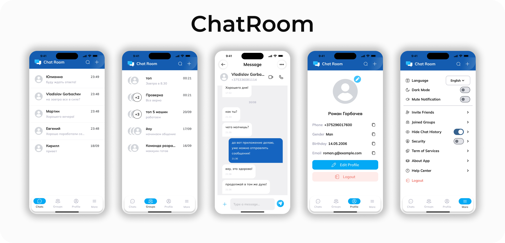

# ChatRoom

## Description

**ChatRoom** is a modern Android application for real-time messaging.  
The entire functionality is built around **Firebase**, providing instant message synchronization and seamless user experience.  
The app follows **Clean Architecture** and **MVVM**, with **Jetpack Compose** for a clean and declarative UI.

## Features

- User registration and login via Firebase Authentication  
- Real-time chat using Firebase Realtime Database  
- Display of user list and active chat rooms  
- User avatars
- Sending text messages and emojis  
- Notifications for new messages  

## Tech Stack

- **Kotlin**  
- **Jetpack Compose**  
- **MVVM + Clean Architecture**  
- **Hilt** for dependency injection  
- **Firebase Authentication** — user management  
- **Firebase Realtime Database** — chat data storage  
- **Firebase Storage** — profile image uploads  
- **Coroutines & Flow** — asynchronous and reactive operations  
- **Coil** — image loading  

## Design

  

